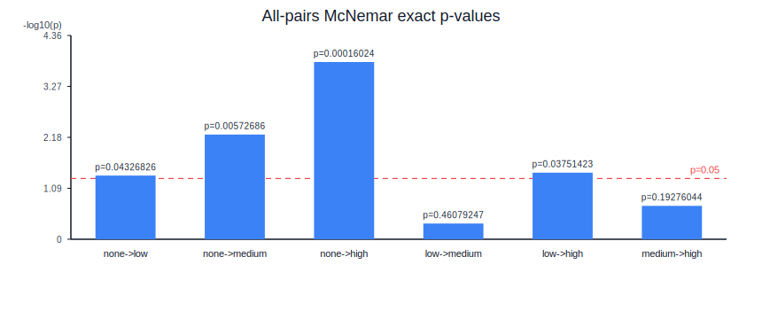

# GPT-5.2 Reasoning Effort Ablation

**Main finding:** GPT-5.2's reasoning effort shows sharply diminishing returns for diagnosis. On 897 paired medical cases, the first step (`none`→`low`) significantly improves accuracy (+2.5pp, McNemar p=0.043), but subsequent increases (`low`→`medium`, `medium`→`high`) add tokens and latency without statistically significant gains.

This repository asks one research question:

> Does increasing GPT-5.2 reasoning effort materially improve diagnosis accuracy, and is the gain worth the token/latency cost?

## Main Result

From the committed artifacts in `reports/`:

| Variant | N | Accuracy | 95% CI | Avg total tokens | Avg latency (s) | Pairwise McNemar p-value vs previous |
|---------|-----|----------|----------------|------------------|------------------|--------------------------------------|
| none | 897 | 0.639 | [0.607, 0.670] | 613.61 | 2.608 | - |
| low | 897 | 0.664 | [0.633, 0.695] | 782.13 | 5.549 | 0.04326826 (none → low) |
| medium | 897 | 0.673 | [0.642, 0.703] | 935.39 | 10.807 | 0.46079247 (low → medium) |
| high | 897 | 0.688 | [0.657, 0.717] | 1088.05 | 13.567 | 0.19276044 (medium → high) |

Pairwise exact McNemar p-values:

- **none → low:** 0.04326826 (discordant: none-correct/low-incorrect = 48, none-incorrect/low-correct = 71)
- **low → medium:** 0.46079247 (discordant: low-correct/medium-incorrect = 41, low-incorrect/medium-correct = 49)
- **medium → high:** 0.19276044 (discordant: medium-correct/high-incorrect = 36, medium-incorrect/high-correct = 49)

p-values are unadjusted exact McNemar unless otherwise stated.



## Scope and Design Choices

This study is intentionally scoped as a controlled ablation on a single axis (reasoning effort) with a fixed grader model. We report unadjusted p-values for pairwise step-up comparisons to minimize the multiple testing burden; the none→low result is borderline and would not survive Bonferroni correction — interpret accordingly. Effect sizes and inter-rater reliability checks against a second grader are natural extensions but are out of scope for this initial release.

The dataset ([zou-lab/MedCaseReasoning](https://huggingface.co/datasets/zou-lab/MedCaseReasoning), test split) skews toward rare diseases and complex case reports. These results characterize reasoning effort scaling on *hard* cases, not general-population clinical performance.
## Quickstart

```bash
python -m venv .venv
source .venv/bin/activate
pip install -e .
cp .env.example .env
# add OPENAI_API_KEY=...
```

Run a low-cost smoke test before launching the full benchmark:

```bash
gpt52-ablation run --variants none high --limit 10
gpt52-ablation grade --variants none high
gpt52-ablation report --discordant-limit 10
```

Run the full study:

```bash
gpt52-ablation run --variants none low medium high
gpt52-ablation grade --variants none low medium high
gpt52-ablation report
```

The `report` command is the one-command step for regenerating the final analysis artifacts from committed study outputs.

## Expected Runtime and Cost

- Runtime and cost scale approximately linearly with case count.
- Reported latency in this repo ranges from roughly `2.6s` (`none`) to `13.6s` (`high`) per case.
- Reported average tokens range from roughly `614` (`none`) to `1088` (`high`) per case.
- For rough budget planning, multiply per-case metrics by your case count and number of variants.
- Run the smoke test first to validate credentials, API quota, and end-to-end pipeline behavior.

## Reproducibility and Artifacts

The study outputs used for the reported results are already committed to this repository.

- `results/` contains raw model outputs
- `scores/` contains grader outputs
- `reports/` contains final summary artifacts used in the write-up

You do **not** need to rerun the benchmark to inspect the published results.

If you want to verify the summaries yourself, you can regenerate `reports/` locally from the committed `results/` and `scores/` files:

```bash
pip install -e .
gpt52-ablation report
```

This rebuilds the final summary artifacts deterministically from the committed study data.

`gpt52-ablation report` writes the following outputs under `reports/`:

- `summary_metrics.csv` and `summary_metrics.json`
- `pairwise_stats.csv` and `pairwise_stats.json`
- `cost_latency_tradeoffs.csv` and `cost_latency_tradeoffs.json`
- `pairwise_mcnemar_p_values.svg`
- `final_report.md`
- `discordant_none_vs_high.json` (manual audit helper)

Artifact policy:

- study outputs are committed to the repo for direct inspection
- final reports can be regenerated locally from `results/` and `scores/`

For full provenance, record:

- repository commit SHA
- Python version
- package versions (`pip freeze` or lockfile)
- dataset identifier and split (`zou-lab/MedCaseReasoning`, `test`)

## Discordant Case Audit Helper

Export reviewable paired disagreements (default: `none` vs `high`):

```bash
gpt52-ablation export-discordant --a none --b high --limit 30
```

Each exported row includes:

- case ID
- gold diagnosis
- both predictions and correctness labels
- visible rationale summaries
- grader diagnosis/reasoning explanations

## Method Snapshot

- Evaluated model: `gpt-5.2`
- Variants: `none`, `low`, `medium`, `high`
- Grader model (fixed): `gpt-4.1`
- Dataset: `zou-lab/MedCaseReasoning` (`test` split)
- Scoring: diagnosis correctness (`0/1`) and reasoning alignment (`0-4`)

Reported statistics:

- per-variant diagnosis accuracy + 95% confidence interval
- paired exact McNemar tests
- token/latency tradeoff and incremental gain tables

## Project Policies

- contribution guidelines: `CONTRIBUTING.md`
- security reporting: `SECURITY.md`
- community behavior expectations: `CODE_OF_CONDUCT.md`

## Limitations

- **Rare-disease skew:** `MedCaseReasoning` is not representative of everyday case mix.
- **Judge-model grading:** labels depend on GPT-4.1 grader behavior, even with a fixed rubric.
- **Visible-rationale scoring:** reasoning is graded only from model-visible rationale output, not hidden chain-of-thought.
